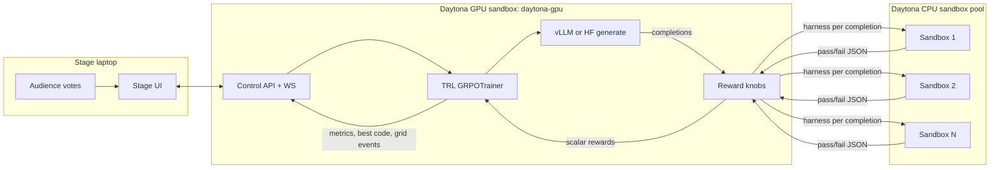

# Architecture

## Context

Talk demo for Daytona AI Engineering (Toronto). Shows reinforcement learning with **verifiable rewards**: model writes code, CPU sandboxes run unit tests, GRPO updates the model. Audience sets the reward.

Sister talks at the event cover Postman agents, agentic-skills security, and enterprise data agents on Daytona. This system must showcase **RL + parallel sandbox eval**, not data-plane enterprise workflows.

## High-level diagram

## Responsibilities

| Component | Runs on | Does | Does not |
|-----------|---------|------|----------|
| Stage UI | Speaker laptop | Votes, display, operator controls | Train, hold weights, call Daytona directly (optional read-only ok) |
| Control API | GPU sandbox | Command surface, websocket fanout, orchestration | Execute untrusted model code locally |
| GRPO trainer | GPU sandbox | Generate completions, compute GRPO loss, optimizer step | Trust model code; all exec in graders |
| Grader pool | CPU sandboxes | Run harness, return results JSON | Load model, touch GPU |

## Data flow (one training step)

1. UI sends `train_steps: 1` (or trainer auto-loops).
2. Trainer generates `N` completions for the locked prompt(s).
3. For each completion: sanitize → banned check → build harness → assign sandbox.
4. Sandboxes execute in parallel (timeout T).
5. Parse last stdout line as JSON `{"results":[bool,...]}`.
6. Map to scalar reward using active λ knobs.
7. GRPO update using group-relative advantages.
8. Emit events: per-sandbox color, mean reward, pass rate, best completion text, step duration.
9. UI paints grid + curve + code panes.

## Process topology

**Recommended talk-day topology**

1. Start / attach `daytona-gpu` sandbox (system snapshot, already Active).
2. Inside it: start control API + trainer worker (same process OK for v1).
3. Warm CPU pool from that process (SDK uses `DAYTONA_API_KEY`).
4. Expose API port via Daytona preview/proxy/SSH tunnel to speaker laptop.
5. Open UI against that base URL in Chromium fullscreen.

**Alternative**: API on GPU sandbox, UI static files served from same FastAPI `StaticFiles`.

## Trust boundaries

- Model-generated code is **untrusted** → only runs in CPU sandboxes.
- Banned patterns are checked **before** exec when possible.
- Stage laptop is trusted operator surface; still no secrets in frontend beyond ephemeral session token if you add one.
- Ghost replay must not need Daytona or GPU.

## State

| State | Storage |
|-------|---------|
| Active task id + reward knobs | Trainer memory + mirrored to UI |
| Sandbox pool ids | Trainer memory |
| Checkpoints | `OUTPUT_DIR/checkpoint-*` on GPU sandbox disk |
| Metrics | `metrics.jsonl` + websocket |
| Ghost run | `ghost/*.jsonl` + optional screen recording note |

## Alignment with Daytona GRPO guide

Keep the same conceptual pieces:

- `TASKS` with prompt, func_name, banned_patterns, tests, reference
- `sanitize_completion` (indent-body extraction for base models)
- Sandbox pool create/reuse/cleanup
- Sync `reward_func` bridging to async eval via dedicated event loop
- Effective batch size **aligned** with pool size

Change for stage: smaller N, weaker/smaller model, control API, UI, reward knobs, ghost failsafe.
